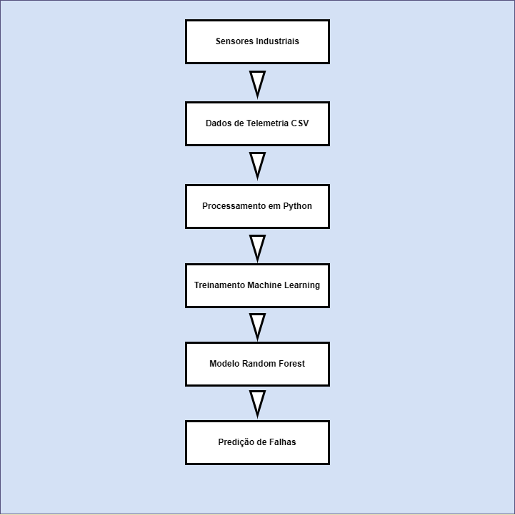
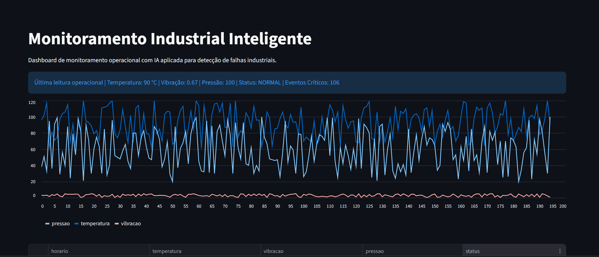

# Detecção de Falhas Industriais com Machine Learning


---

## Visão Geral

Este projeto simula uma solução de monitoramento industrial inteligente utilizando Machine Learning para identificar condições operacionais críticas em equipamentos industriais.

A solução foi desenvolvida para representar cenários reais de analytics industrial encontrados em operações de mineração, ferrovia, porto, logística e manufatura.

O projeto contempla:

- Geração de dados de telemetria
- Processamento de dados
- Treinamento de modelo de Machine Learning
- Predição de falhas operacionais
- API REST com FastAPI
- Dashboard operacional em tempo real
- Monitoramento contínuo de sensores

---

## Problema de Negócio

Ambientes industriais geram grandes volumes de dados operacionais provenientes de sensores, máquinas e sistemas de telemetria.

Este projeto demonstra como Inteligência Artificial pode ser aplicada para:

- Detectar comportamentos operacionais anormais
- Identificar condições críticas de equipamentos
- Apoiar estratégias de manutenção preditiva
- Melhorar a confiabilidade operacional
- Auxiliar operações industriais em tempo real

---

## Tecnologias Utilizadas

- Python
- Pandas
- Scikit-Learn
- Joblib
- FastAPI
- Streamlit
- AWS S3
- AWS Athena
- SQL
- Git & GitHub

---

## Arquitetura do Projeto



```text
Sensores Simulados
        ↓
Geração de Telemetria
        ↓
Machine Learning Model
        ↓
FastAPI Prediction API
        ↓
Dashboard Streamlit
        ↓
Monitoramento em Tempo Real
```

---

## Estrutura do Projeto

```text
industrial-failure-detection/
│
├── assets/
├── data/
├── models/
├── prints/
├── scripts/
│   ├── predict_failure.py
│   ├── realtime_monitor.py
│   └── train_model.py
│
├── .gitignore
├── app.py
├── dashboard.py
├── requirements.txt
└── README.md
```

---

## Modelo de Machine Learning

O projeto utiliza um modelo Random Forest Classifier para identificar padrões de risco operacional com base em:

- Temperatura
- Vibração
- Pressão

### Classificação alvo

- Normal
- Crítico

---

## Exemplo de Predição

### Condição operacional crítica

```python
{
    "temperatura": 115,
    "vibracao": 4.5,
    "pressao": 90
}
```

### Resultado da previsão

```text
ALERTA: Equipamento crítico!
```

---

## API REST

A aplicação possui API REST utilizando FastAPI para realizar previsões operacionais em tempo real.

### Executar API

```bash
uvicorn app:app --reload
```

### Documentação automática

```text
http://127.0.0.1:8000/docs
```

---

## Dashboard Operacional

O sistema possui dashboard interativo desenvolvido com Streamlit para:

- Monitoramento em tempo real
- Visualização da telemetria
- Histórico operacional
- Indicadores críticos
- Análise de comportamento dos sensores

### Executar dashboard

```bash
streamlit run dashboard.py
```

---

## Prints do Projeto

### Dashboard Operacional


---

### API FastAPI


---

## Métricas do Modelo

```text
              precision    recall  f1-score   support

           0       1.00      1.00      1.00       115
           1       1.00      1.00      1.00        85

    accuracy                           1.00       200
   macro avg       1.00      1.00      1.00       200
weighted avg       1.00      1.00      1.00       200
```

---

## Como Executar o Projeto

### Clonar repositório

```bash
git clone https://github.com/SymonCosta/industrial-failure-detection.git
```

---

### Criar ambiente virtual

```bash
python -m venv .venv
```

---

### Ativar ambiente virtual

#### Windows

```bash
.venv\Scripts\activate
```

---

### Instalar dependências

```bash
pip install -r requirements.txt
```

---

### Executar API

```bash
uvicorn app:app --reload
```

---

### Executar Dashboard

```bash
streamlit run dashboard.py
```

---

## Próximas Evoluções

- Deploy em cloud
- Streaming de telemetria em tempo real
- Banco de dados operacional
- Dashboard avançado
- Alertas inteligentes
- Detecção avançada de anomalias
- Integração com visão computacional
- Integração com AWS Glue
- Pipeline de dados em tempo real

---
## Demonstração do Dashboard



## Autor

### Symon Costta

Analytics | IA Aplicada | Engenharia de Dados | AWS | Python | SQL

GitHub:
https://github.com/SymonCosta